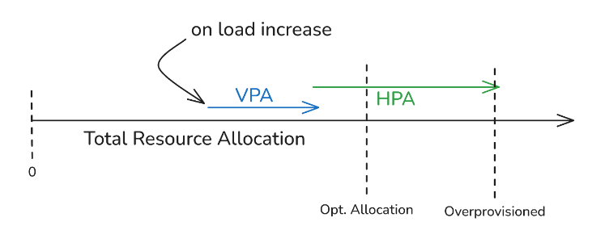
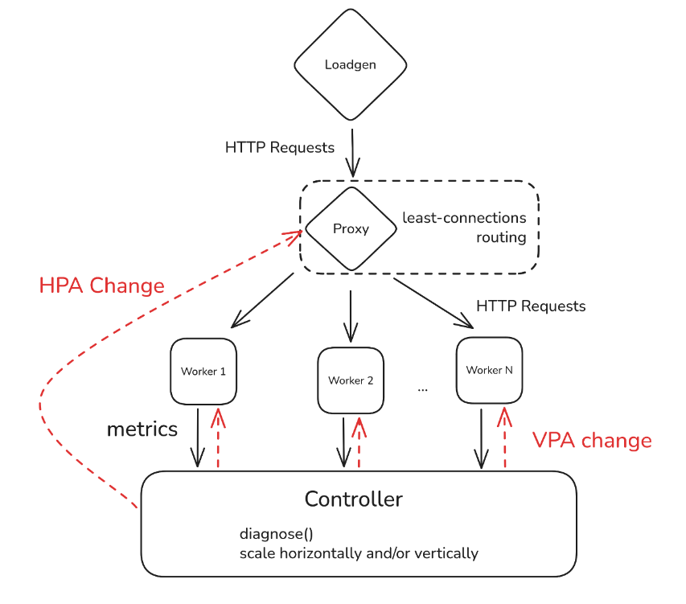
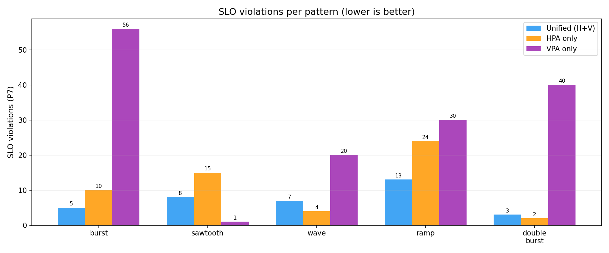
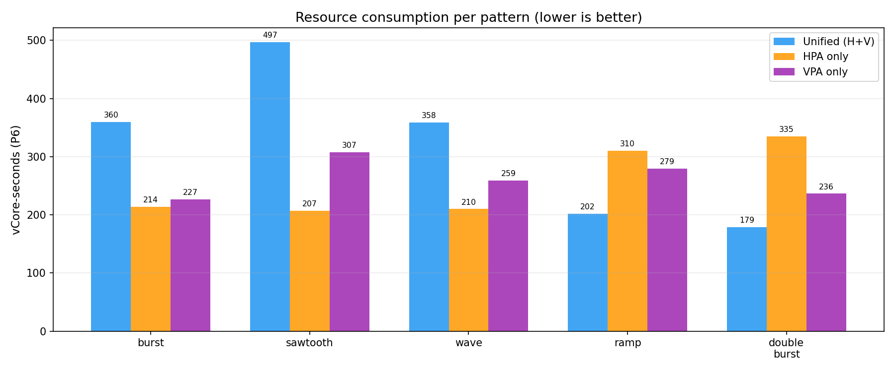
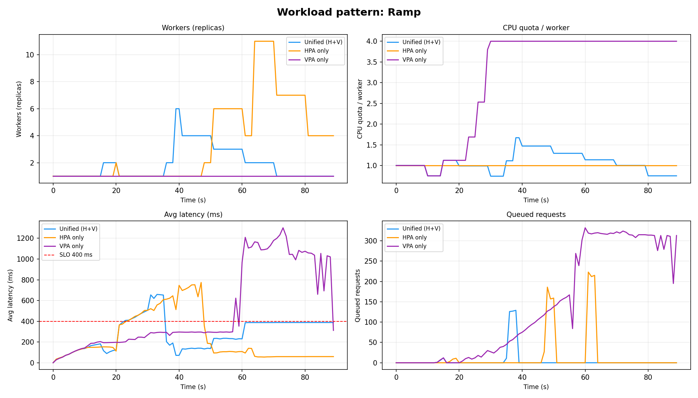
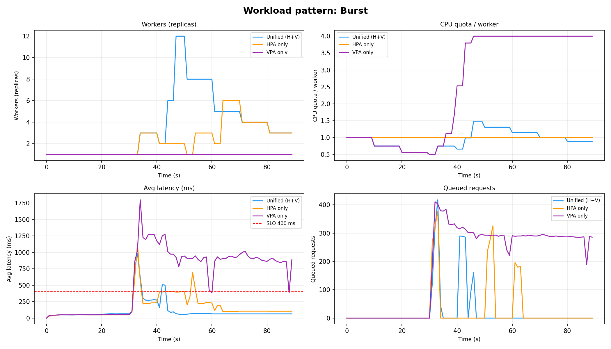

#+title: A Unified Cloud Autoscaler
#+author: Kshitij Kapoor
#+date: 2026-05-01 Fri
#+OPTIONS: toc:nil
#+LATEX_HEADER: \usepackage[margin=0.75in]{geometry}
#+LATEX_HEADER: \usepackage{abstract}
#+LATEX_HEADER: \setlength{\columnsep}{0.25in}
#+LATEX_HEADER: \usepackage{booktabs}
#+LATEX_CLASS_OPTIONS: [twocolumn]

#+BEGIN_abstract

Cloud autoscalers typically exist in one of two directions: Horizontal or vertical. Horizontal autoscalers (HPA) manage the allocation and deallocation of replicas. Vertical autoscalers (VPA) manage the amount of compute given to each replica. In general, horizontal autoscalers are slow to react but can handle sustained load. On the other hand, vertical autoscalers are fast but hit fundamental resource limits. Having both autoscalers running at the same time leads to further issues - the autoscalers fight each other and lead to worse performance overall. Both of the positive qualities of the two kinds of autoscalers is desired, however.

Therefore, I have implemented a simulated unified autoscaler that handles both vertical and horizontal autoscaling. The implementation creates several docker containers that act as workers. The workers each report their metrics to a central controller, and the controller decides how to scale in either direction. This prevents conflicting decisions between the HPA or VPA. On top of this, I have formally verified the code, performed a lyapunov stablity analysis to prove convergence, and ran several experiments to analyze performance. The empirical analysis hints that the unified autoscaler may perform better than HPA or VPA only autoscalers under certain workload patterns.

#+END_abstract

* Introduction

Modern cloud services must handle workloads that are bursty and unpredictable. Even on a day-by-day timescale, there may be several instances of drastic spikes in load. A solution to this might be to overprovision a particular service to consistently meet service-level objectives (SLOs). However, that, in and of itself, is expensive.

Two families of autoscalers have emerged to address these issues: Horizontal Pod Autoscalers (HPAs), which add or remove replicas, and Vertical Pod Autoscalers (VPAs), which adjust the CPU and memory allocated to each replica to mitigate cost and handle more requests per pod. HPAs have the benefit of being able to handle sustained, effectively infinite load (one can always just allocate another replica), but being slow to respond to incoming signals (as replicas take time to initialize and begin servicing requests). On the other hand, VPAs are fast, involivng OS-level policy tweaks to function, but are fundamentally resource limited, as there is only so much compute a single replica may have.

Both of the positives of the two families of autoscalers are sought after. It is desirable for scaling to be fast and simultaneously handle sustained load. So, one may think it is a good idea to run both autoscalers for a particular service. However, in practice, running both autoscalers causes them to fight each other as they act indepdentently, leading to an instable system that wastes resources and causes latency spikes that lead to violations of SLOs.

#+CAPTION: Toy example showcasing interference between independent HPA and VPA controllers.
#+NAME: fig:interference
#+ATTR_LATEX: :width 0.9\columnwidth

Figure $\ref{fig:interference}$ shows a toy example where the axis represents the overall resource amount devoted in the system. When load hits the system, the quick-moving VPA first boosts the resources of each worker, getting close to the optimal allocation. Then, the slower-moving HPA attempts to also correct for this load, drastically overshooting the optimal allocation, leading the system to be overprovisioned. Although not shown here, at future timesteps this problem is bound to get worse - both autoscalers will attempt to individually correct for this overprovisioning of resources, leading to instability in the system.

This report presents a unified autoscaler that resolves the interference problem by replacing two independent controllers with a single, unified controller. The controller represents system state as a tuple $x = (q, r, c, m)$ - queue depth, replica count, CPU per replica, and memory per replica - and at each control tick diagnoses the current bottleneck and acts on at most one axis, preventing the interference problem as discussed above.

An overview of this work is as follows:

1. *Implementation.* A unified HPA+VPA controller backed by real Docker worker containers, with a load generator supporting five workload patterns (burst, sawtooth, wave, ramp, double-burst) and three comparison policies (unified, HPA-only, VPA-only).

2. *Formal verification.* An ACL2 verification of two key properties regarding the correctness of the controller implementation.

3. *Lyapunov stability analysis.* Four theorems are proven: deadbeat queue drain when capacity exceeds arrival rate, an input-to-state stability bound on queue depth, geometric convergence of vertical resources, and a monotonicity argument proving HPA and VPA actions are non-interfering by construction.

4. *Experimental evaluation.* Across five workload patterns the unified controller wins or ties HPA-only on SLO violations in four of five cases, and achieves lower vCore-second cost on ramp and double-burst, while VPA-only consistently produces the worst tail latency.

* System Architecture
<<sec:arch>>
** Overview

The system architecture involves several docker containers acting as workers running a toy HTTP service with simulated load-generation that first hits a proxy. The proxy does least-connections routing to the workers. Worker metrics are reported to a centralized controller that decides a target state to be updated in the next tick.

#+CAPTION: A diagram showcasing the overall system architecture. The top layer is the load generation, which generates random HTTP requests that hit a proxy. The proxy re-routes these requests to each worker, where the requests require some CPU or memory intensive compute. The workers also report metrics to a unified controller, which diagnoses the system state and reports the changes required to either the workers or the proxy. Note: there are some abstractions here that may not represent reality.
#+NAME: fig:architecture
#+ATTR_LATEX: :width 0.9\columnwidth

** Control Loop

The system follows a centralized control architecture. A load generator sends HTTP requests to a stable proxy endpoint. The proxy routes each incoming request to the least-loaded worker container using least-connections routing. A central controller runs on a fixed 10-second interval: it polls a =/metrics= endpoint on every live worker, aggregates the results into a system-wide state snapshot, classifies the current bottleneck, and produces a =TargetState= specifying the desired replica count, CPU per replica, and memory per replica. An executor then creates and/or destroys containers to meet the target. Because both horizontal and vertical decisions emerge from a single =TargetState= each tick, the two axes cannot issue conflicting actions.

An emergency fast-path bypasses the 10-second interval when the aggregated queue depth exceeds 20 requests, invoking the controller immediately to prevent unbounded queue growth during sharp spikes.

** Worker Design

Each worker is a Docker container running a toy HTTP service. Request processing is gated by a counting semaphore of capacity $S = 32$ concurrent slots. When a request arrives and a slot is available, it is admitted immediately and processed by a fixed-size thread pool. When all slots are occupied the request blocks inside the semaphore - this blocked population is the queue $q(t)$ visible to the controller. Once the thread pool completes the work, the slot is released and one waiting request is admitted. This design produces real, observable queuing that accurately reflects the capacity of the replica. However, there is some criticism to be had about the fixed $S = 32$ concurrency slots, which we will discuss in a later section.

Vertical scaling: when the controller raises the CPU quota via =docker update --cpus=, the OS cgroup allows each thread to execute faster, reducing the time a slot is held and increasing effective throughput without changing the replica count or the concurrency limit $S$. In this way, the vertical scaling is much faster acting than the horizontal scaling is.

** Proxy and Load Balancing

The proxy maintains a shared backend list updated whenever the executor starts or stops a container. Each incoming TCP connection is forwarded to whichever worker has the smallest in-flight count at the moment of arrival. This can be done since only one proxy exists in the system.

** Controller Design

The controller's =decide()= function runs in two phases: /diagnosis/ and /scaling/.

/Diagnosis/ classifies the current state into one of seven bottleneck categories according to Table \ref{tab:diagnosis}. The 70% and 28% thresholds come from the theoretical analysis in a later section. Note that because the rolling average of latency may remain high for minutes even after a burst clears, high latency is ignored unless there is some potential alternative evidence for load, like a non-empty queue. An alternate solution to this problem may have been to utilize an exponential moving average instead, but that remains unexplored for now.

#+CAPTION: Bottleneck diagnosis rules. $q$ = queue depth, $u$ = CPU utilization, $m$ = Memory, $r$ = replica count. Note that some actions are left out, such as reductions in CPU and memory on scale in events.
#+NAME: tab:diagnosis
#+ATTR_LATEX: :booktabs t :font \small :align lll
| Category    | Condition                           | Action            |
|-------------+-------------------------------------+-------------------|
| =Load=      | $q > 0$, $u \le 70\%$               | Scale out         |
| =Cpu=       | $q > 0$ or high latency, $u > 70\%$ | $u \times 1.3$    |
| =Memory=    | $q > 0$ or high latency, m $> 70\%$ | $m \times 1.3$    |
| =Mixed=     | $u > 70\%$ and m $> 70\%$           | $u, m \times 1.2$ |
| =Overprov.= | $q=0$, $u < 28\%$, $r > r_{\min}$   | Scale in          |
| =Stable=    | $q=0$, $u \le 70\%$                 | $u \times 0.9$    |
| =Unknown=   | None of the above                   | No action         |

/Scaling/ maps each bottleneck class to a concrete action. Under any load-class bottleneck the target replica count is set to $\lceil (q + A) / S \rceil$, where $A$ is the estimated active concurrency. This increase is capped at $3 \times r$ (where $r$ is the current replica count) to prevent any drastic overshoot. CPU or memory bottlenecks additionally scale the vertical resource up by $1.3\times$ before computing the replica target.

Under =Overprovisioned= the replica count is stepped down by $0.7\times$ and CPU is drained concurrently at $0.88\times$; at the minimum replica count the drain accelerates to $0.65\times$. Under =Stable= CPU drains at $0.9\times$ provided the queue is empty and utilization is below 35%. All targets are clamped to their configured min/max bounds before being applied.

* Formal Analysis

I identify nine correctness properties for the unified autoscaler:

#+NAME: tab:properties
#+CAPTION: Correctness properties and proof strategies.
#+ATTR_LATEX: :booktabs t :font \small :align lll
| # | Property         | Proof Strategy       |
|---+------------------+----------------------|
| 1 | Safety           | Formal Verification  |
| 2 | Stability        | Lyapunov Analysis    |
| 3 | Responsiveness   | Lyapunov Analysis    |
| 4 | No Thrashing     | Lyapunov Analysis    |
| 5 | Non-interference | Implicit             |
| 6 | Efficiency       | Empirical Analysis   |
| 7 | SLO Preservation | Empirical Analysis   |
| 8 | Convergence      | Lyapunov Analysis    |
| 9 | Monotonicity     | Formal Verification  |

Properties 1 and 9 are verified in ACL2 (\S\ref{sec:acl2}).

Properties 2-5 and 8 are established via Lyapunov Stability analysis
(\S\ref{sec:lyapunov}).

Properties 6-7 are validated empirically (\S\ref{sec:eval}).

** Formal Verification
<<sec:acl2>>

This formal verification portion exists to verify certain correctness properties of the simulated code itself.

*** Verifiable Properties

1. Safety: Targeted replica count and cpu utilization are always within a specified bound

   This property exists to simply prevent violation of user-specified bounds. If a user says that they are only willing to pay for ten replicas, the autoscaler must never target greater than ten replicas. Conversely, if a user states that they want a minimum of three replicas, the autoscaler must never target less than three replicas.

2. Monotonicity: If queue depth increases, the allocated replicas do not decrease

   This property simply argues that more demand reaching the system must mean that the controller either keeps the same resource allocation or scales up - the controller must /never/ scale down when more load hits. This involves proving that the aforementioned =replicas-for-demand= calculation is monotone.

*** ACL2 Model and Verification

The controller is modeled as pure functions over an integer state tuple =(queue, cpu-util, mem-util, num-replicas, lat)=. Floating point values are modeled as fixed-point integers.

ACL2 is chosen for this verification.

The key functions that are modeled are:
1. =ac-clamp= - the final clamp bound applied to every output
2. =ceil-div= - a model of rust's =ceil()= function to represent the replica count math
3. =replicas-for-demand= - key function to compute the target replica count from queue + utilization
4. =ac-diagnose= - represents the diagnoses that the controller would issue
5. =ac-scale= - the full scaling decision returned

**** Argument for Model Equivalence

1. Every ACL2 function mirrors its Rust counterpart branch-for-branch. The match branch in the Rust code directly mirrors the case by case handle in =ac-scale=.
2. Both Rust and ACL2 apply resource bounds exactly once, as the final operation before returning. Any divergence in the intermediate arithmetic that may come from incorrect representations of things like floating point values is fundamentally bounded due to the clamp. This means that for any input, =ac-decide= returns values in the same [lo, hi] interval as the Rust code's =decide()=. The intermediate differences do not matter here.

Note that the equivalence is not proven mechanically.

**** Theorems Proved

*Safety (P1).* The following theorems ensure that the target state decided by the controller always remains within the required bounds:

- =safety-replicas=: replica count $\in$ [=min-replicas=, =max-replicas=]
- =safety-cpu=: CPU allocation $\in$ [=min-cpu=, =max-cpu=]
- =safety-mem=: memory allocation $\in$ [=min-mem=, =max-mem=]

Because the clamp is the last step, if that holds to the ranges required, then we have proven that the safety property is met.

*Monotonicity (P9).* Two theorems establish that the controller never scales down under increasing load:

- =no-scale-down-under-load=: if =queue > 0=, output replicas $\geq$ current replicas
- =monotone-queue-under-load=: if queue depth increases, output replicas do not decrease

These follow from =rfd-monotone-in-queue= and =rfd-monotone-in-util=, which prove that =replicas-for-demand= is monotone in both queue depth and utilization.

All of the above theorems and several others produce Q.E.D. in ACL2.

** Lyapunov Stability Analysis
<<sec:lyapunov>>

The brunt of the theoretical analysis is done in this section of this report.

The system may be modeled as a discrete-time dynamical system, allowing us to define a Lyapunov function for the system.

*** Verifiable Properties

The properties that this analysis attempts to verify are as follows:

2. [@2] *Stability* - the queue does not grow (in stable workload conditions)
3. *Responsiveness* - correction for spikes is bounded in time (in stable workload conditions)
4. *No thrashing* - small noise in metrics cannot cause continuous flip-flop in allocation
5. *HPA/VPA non-interference* - the system cannot accidentally work against itself
8. [@8] *Convergence* - related to property #2 - the system converges (in stable workload conditions)

*** System Model

The system is modeled as a discrete-time dynamical system. The state at each control tick is:

$$\mathbf{x}(t) = \bigl(q(t),\ r(t),\ c(t),\ m(t)\bigr)$$

where $q$ is queue depth, $r$ is replica count, $c$ is CPU per replica, and $m$ is memory per replica. The queue can be modeled as:

$$q(t+1) = \max\bigl(0,\ q(t) + \lambda - \mu(r,c)\bigr), \qquad \mu(r,c) = r \cdot c \cdot \kappa$$

where $\lambda$ is the arrival rate (RPS) and $\kappa = 100$ RPS/vCore is the service rate constant. The controller chooses $r^*(t)$ and $c^*(t)$ to define the next target state.

The $\mu(r, c)$ function represents the total service capacity of the system - the amount of requests that may be handled at the timestep.

*** Deadbeat Queue Drain (P2, P8)
<<sec:deadbeat>>

For now, to show these properties, let us first assume that replica start-up is instant in time. We know this is not true in the real system, so we will break this assumption later.

Let

$$A = \left\lfloor \frac{u}{100} \cdot r \cdot S \right\rfloor$$

denote the estimated number of slots currently in service, where $u \in [0, 100]$ is CPU utilization expressed as a percentage and $S = 32$ is slots per replica. The controller sets:
$$r^* = \left\lceil \frac{q + A}{S} \right\rceil$$

Effectively, $A$ is supposed to be the amount of work that is currently going on in the system.

By the definition of ceiling division, $r^* \cdot S \geq q + A$. Subtracting $A$ from both sides gives the number of free slots:
$$r^* \cdot S - A \geq q$$

Since $A$ slots are already occupied, the remaining $r^* \cdot S - A$ free slots are sufficient to service all $q$ queued requests in the same tick, giving
$$q(t+1) = q(t) - (r^* \cdot S - A) \leq 0$$
The queue drains to zero in a single control tick once replicas are active --- this is a deadbeat case. Once replicas are active, the queue must fully drain and the system must become stable.

*** ISS Bound Under Provisioning Delay (P3)

We previously assumed that the replica scaling is instant. In reality, growth replicas take time to initialize.

Let's say new replicas require $\tau$ seconds to become active. During this delay the queue grows open-loop, giving an input-to-state stability (ISS) ultimate bound:
$$q(t + \tau) \leq q(t) + \lambda\tau \implies q \leq \lambda\tau$$
Under the normal 10 s control interval this is $10\lambda$.

The controller provides an emergency path that fires when $q \geq 20$, reducing the effective delay to $\tau = 3$ s and bounding the backlog to $3\lambda$ under sustained overload.

*** Vertical Stability: Eigenvalue Analysis (P4)

The vertical controller adjusts CPU quota $c(t)$ with two saturated linear rules. Note that it is also responsible for the memory quota $m(t)$ but that has been left out of this discussion for brevity as it is roughly the same.

*Scale-down* (overprovisioned):
$$c(t+1) = \max(c_{\min},\; 0.9\,c(t))$$
The distance to the floor shrinks by 10% each tick, so convergence is geometric:
$$c(t) - c_{\min} \;\leq\; 0.9^{\,t}\,(c(0) - c_{\min})$$
Starting from $c_{\max} = 4.0$, this reaches $c_{\min} = 0.5$ in at most
$T_v = 20$ steps.

*Scale-up* (CPU bottleneck):
$$c(t+1) = \min(c_{\max},\; 1.3\,c(t))$$
Quota grows by 30% per step, so the gap $c_{\max} - c(t)$ closes geometrically with ratio $1/1.3$. Starting from $c_{\min} = 0.5$, the system reaches $c_{\max}$ in at most $T_u = 8$ steps.

In either direction the controller always moves $c(t)$ closer to the target and never overshoots, so the vertical arm cannot diverge or oscillate, meaning that it is stable.

*** Lyapunov Function and Global Convergence (P2, P8)

I define the following lyapunov function:
$$V\!\bigl(\mathbf{x}(t)\bigr) = q(t) + \alpha\bigl(c(t) - c_{\min}\bigr) + \beta\bigl(m(t) - m_{\min}\bigr), \qquad \alpha, \beta > 0$$
where $\alpha$ and $\beta$ are just some tunable weights given to cpu or memory overprovisioning.

*Under load* ($q > 0$): from the previous result in \S\ref{sec:deadbeat}, the replica formula ensures capacity exceeds demand, so $\Delta V \leq -q(t) < 0$. This is the deadbeat case.

*Overprovisioned* ($q = 0$, utilization $< 28\%$): the controller applies a geometric CPU drain $c(t+1) = 0.9\, c(t)$, giving:
$$\Delta V = \alpha\bigl(0.9\,c(t) - c(t)\bigr) = -0.1\,\alpha\,c(t) < 0$$

In both phases $\Delta V < 0$. Something good always happens here, and the lyapunov function goes to 0. This means that under stable conditions the system must eventually converge to something stable.

*** No Thrashing (P4)

The controller uses a deadband between scale-up and scale-down thresholds:
$$\bar{u} = 70\%, \qquad \underline{u} = 0.4 \times 70\% = 28\%, \qquad \frac{\bar{u}}{\underline{u}} \approx 2.5\times$$
A slight change in metrics would simply not cause any state transition here - it would be within this deadband ratio, and so the controller would not invoke a scale-up or scale-down. Small measurement noise is within the deadband, so thrashing is prevented.

*** HPA/VPA Non-Interference (P5)

Let
$$A(c) = \lambda S / (c\kappa)$$
be the estimated active concurrency, or the estimated amount of work going on in the system, at CPU quota $c$.
The HPA replica formula is
$$\hat{r}(c) = \lceil (q + A(c))/S \rceil$$
Suppose the VPA portion of the controller increases CPU: $c' > c$. Then:
$$A(c') = \frac{\lambda S}{c'\kappa} < \frac{\lambda S}{c\kappa} = A(c)$$
Since $q + A(c') < q + A(c)$ and the ceiling does not matter here:
$$\hat{r}(c') = \left\lceil \frac{q + A(c')}{S} \right\rceil \leq \left\lceil \frac{q + A(c)}{S} \right\rceil = \hat{r}(c)$$
A VPA scale-up can only lower the demand as seen by the HPA. This means that the HPA will /only/ maintain the scaling or scale-down, never up. This means that the two axes in the unified controller are non-interfering.

* Empirical Analysis
<<sec:eval>>

** Experimental Setup

The experiment was run locally, on the simulated system. The unified controller as described above was tested against an HPA-only controller and a VPA-only controller.

Five different workload patterns were ran for ninety seconds: burst, double-burst, ramp, sawtooth, and wave.

1. *Burst* - flat baseline RPS, then a sudden step up to a peak for a fixed amount of time, and then back down.
2. *Double-Burst* - same as the burst but two separate spike windows.
3. *Ramp* - load increases slowly and linearly from a baseline to peak, then holds at peak.
4. *Sawtooth* - load ramps linearly for some short time, then drops instantly to the baseline. Repeats.
5. *Wave* - cyclic, wave-like growth and decay of load.

The metrics that were taken note of were:

1. vCore-seconds - $r(t) \times c(t)$ summed over all ticks.
2. SLO Violations at $>400ms$ latency - count of seconds where the average latency $>400ms$

** Results

#+ATTR_LATEX: :width \columnwidth
#+CAPTION: SLO violations (latency > 400 ms) per policy across all five workload patterns.

#+ATTR_LATEX: :width \columnwidth
#+CAPTION: Total vCore-seconds consumed per policy across all five patterns.

The unified controller wins or ties HPA-only on SLO violations in four of five patterns: burst (5 vs. 10), double-burst (3 vs. 2), ramp (13 vs. 24), and sawtooth (8 vs. 15). Wave is the only loss (7 vs. 4). VPA-only is worst in four of five patterns - peak latency of 1800 ms on burst - simply because of that fundamental resource limitation that was discussed earlier.

#+ATTR_LATEX: :width \columnwidth
#+CAPTION: Ramp pattern: unified controller queue, workers, CPU quota, and latency over time.

#+ATTR_LATEX: :width \columnwidth
#+CAPTION: Burst pattern: unified vs. HPA-only vs. VPA-only response to a sudden traffic spike.

The unified controller typically consumes more resources than the HPA-only controller (in terms of total vCore-seconds) on some workloads, but there is a good degree of variance here.

** Discussion

The biggest takeaway from these results is that the unified controller seems to be "the best of both worlds" only when workload is unpredictable. It achieves good results on burst-y workloads, but struggles on repetitive ones like the wave pattern. However, it seems reasonable for the most part, and it finds a trade-off in being slightly more resource intense and still being able to respond quickly, leading to fewer SLO-violations overall.

The above results are clearly explained by the fact that the vertical scaling is instantaneous. On burst, the unified controller is able too immediately act by increasing the CPU dedicated to each worker, which the data supports.

Moreover, the fact that the unified controller has access to another axis of scaling helps tremendously in the ramp scenario. The HPA must allocate 11 workers to handle the load at its peak, but the unified controller can allocate 6 workers running at higher CPU, consuming fewer resources overall.

My best guess for these results in which the unified controller loses to the HPA is that the HPA being slow to react helps prevent oscillations in niche scenarios, leading to better handling of load in those cases.

Overall, the results seem to support the idea that the unified controller has significant benefits under certain workload patterns, but can be strictly worse in others. There is an argument that this could be indicative of further optimization being required.

* Criticisms and Future Work

One key assumption made in the system is the aforementioned value for $S$, or the estimate of maximum concurrency for each worker. Allowing that value to be user-specified allows for more rigid analysis on the system, but is not incredibly practical for a real system. It may be reasonable to measure $S$ empircally at runtime and tune controller parameters based on that, but that work is not explored in this report.

Another criticism to be had is that all experimentation is done locally and not in an actual cloud deployment environment. Future work would involve deploying to a cloud service to benchmark performance.

* Conclusion

This report presented a unified horizontal + vertical autoscaler, proved the correctness of its implementation, analyzed its stability, and validated it empirically. The analysis showed that the controller may win on unpredictable, burst-y workloads but struggles on cyclic, smooth ones. Future work may include the breaking of certain assumptions made in the analysis and real cloud deployment.

Thank you for reading.
